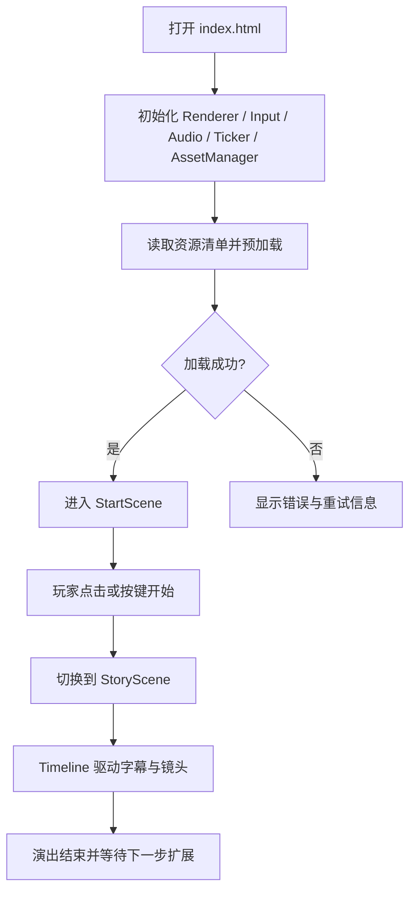

## 1. 产品概述
一个可直接双击 `index.html` 运行的纯离线 Canvas 游戏项目骨架，面向剧情驱动、轻动作或探索类 H5 游戏原型开发。
- 目标是提供零依赖、易扩展、适合本地打包与交付的基础引擎层，包括场景、渲染、资源、输入、音频、时序与镜头能力。
- 产品价值在于让策划、美术、前端工程师可以围绕统一骨架快速迭代玩法、演出与剧情转场，而不依赖构建工具或在线服务。

## 2. 核心功能

### 2.1 功能模块
1. **启动入口页**：创建 Canvas、初始化引擎模块、显示加载进度、进入首个场景。
2. **开始场景**：作为最小可运行示例，展示文本、按钮交互、场景切换与基础相机逻辑。
3. **剧情场景**：展示 Timeline/Tween 能力，驱动字幕渐入渐出、镜头推拉、串并行动画。
4. **资源管理模块**：预加载图片、音频、JSON，支持失败重试、进度回调、统一读取接口。
5. **运行时引擎模块**：提供 `SceneManager`、`Renderer`、`Input`、`Audio`、`Ticker`、`Timeline`、`Tween`。

### 2.2 页面与模块说明
| 页面名称 | 模块名称 | 功能说明 |
|-----------|-------------|---------------------|
| 启动入口 | 引擎初始化 | 创建游戏实例、挂载 Canvas、配置尺寸与缩放、启动预加载 |
| 启动入口 | 加载反馈 | 展示资源加载百分比、错误信息与重试结果 |
| 开始场景 | 标题与提示 | 显示游戏标题、简短说明与进入剧情按钮 |
| 开始场景 | 输入交互 | 响应点击与键盘输入，触发场景切换 |
| 剧情场景 | 字幕演出 | 字幕淡入、停留、淡出 |
| 剧情场景 | 镜头控制 | 使用 `camera` 对象实现缩放、平移、景别变化 |
| 剧情场景 | 时间轴编排 | 支持序列、并行、延迟、缓动组合 |

## 3. 核心流程
用户打开本地 `index.html` 后，系统初始化引擎并开始预加载资源。加载完成后进入开始场景，玩家通过键盘或点击进入剧情场景，剧情场景通过时间轴驱动字幕与镜头演出，结束后可回到开始场景或继续扩展新关卡。

## 4. 用户界面设计
### 4.1 设计风格
- 主色调：深色宇宙背景、暖色高亮文字、青蓝色辅助线条。
- 按钮风格：简洁矩形描边按钮，悬停/聚焦时增加发光描边。
- 字体与字号：优先使用系统字体栈，标题大字号、正文中字号、字幕小字号。
- 布局风格：桌面优先，居中舞台式布局，Canvas 为主视觉载体。
- 图形建议：少量星点、暗角、网格辅助线，突出“剧情演出控制台”气质。

### 4.2 页面设计概览
| 页面名称 | 模块名称 | UI 元素 |
|-----------|-------------|-------------|
| 启动入口 | 加载反馈 | 进度文本、错误提示、深色背景、简洁状态文案 |
| 开始场景 | 标题区 | 大标题、副标题、开始提示、轻微浮动动画 |
| 剧情场景 | 字幕层 | 底部字幕框、透明渐层、白色字幕文字 |
| 剧情场景 | 镜头层 | 通过 camera 缩放和平移改变画面构图 |

### 4.3 响应式策略
- 采用桌面优先设计，默认逻辑分辨率固定，Canvas 按窗口等比缩放。
- 支持鼠标、键盘与基础触控指针输入。
- 不依赖网络字体或远程资源，保证离线环境一致性。
