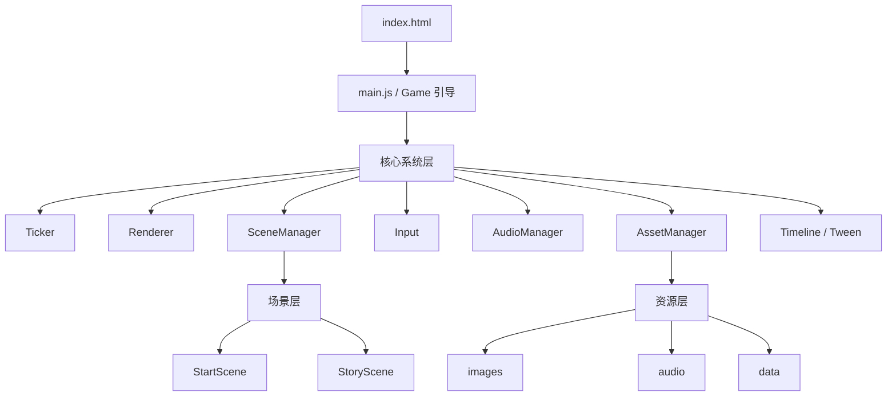

## 1. 架构设计


## 2. 技术说明
- 前端技术：原生 HTML5 + Canvas 2D + ES Modules。
- 开发语言：纯 JavaScript（按 TypeScript 友好的模块组织与 JSDoc 风格编写，后续可平滑迁移到 TypeScript）。
- 运行方式：无构建、无打包、无第三方依赖，可本地直接打开 `index.html` 运行。
- 资源策略：优先使用相对路径本地资源；JSON 在 `file://` 场景下通过内嵌清单兜底，避免浏览器本地文件权限差异导致失败。
- 渲染策略：固定逻辑分辨率，Canvas 自适应缩放；相机通过平移、缩放作用于世界坐标。

## 3. 目录定义
| 路径 | 用途 |
|-------|---------|
| /index.html | 本地启动入口，挂载 Canvas 与调试 UI |
| /src/main.js | 初始化游戏并装配资源清单、起始场景 |
| /src/core/Game.js | 组合核心系统并提供统一上下文 |
| /src/core/SceneManager.js | 负责场景切换、生命周期与更新分发 |
| /src/core/Renderer.js | 管理 Canvas、分辨率、自适应与绘制辅助 |
| /src/core/AssetManager.js | 负责图片、音频、JSON 预加载与资源访问 |
| /src/core/Input.js | 处理键盘、鼠标、指针输入状态 |
| /src/core/AudioManager.js | 管理音频播放、停止与音量控制 |
| /src/core/Ticker.js | 提供主循环、deltaTime、fixed update 入口 |
| /src/core/timeline/*.js | Timeline、Tween、缓动函数实现 |
| /src/scenes/StartScene.js | 最小可运行演示场景 |
| /src/scenes/StoryScene.js | 时间轴/字幕/镜头演示场景 |
| /src/data/assets.js | 资源清单与离线 JSON 示例 |
| /assets/* | 本地图片、音频、数据资源目录 |

## 4. 核心接口定义
```js
// AssetManager
preload(manifest, options)
getImage(id)
getAudio(id)
getJSON(id)

// Scene
enter(prevScene)
exit(nextScene)
update(dt)
render(renderer)

// Timeline
sequence(steps)
parallel(steps)
delay(seconds)
tween(target, to, duration, options)
update(dt)
```

## 5. 数据与资源定义
### 5.1 资源清单结构
```js
{
  images: [{ id: "bg", src: "./assets/images/bg.png" }],
  audio: [{ id: "click", src: "./assets/audio/click.mp3" }],
  json: [{ id: "story", src: "./assets/data/story.json", inlineData: { lines: [] } }]
}
```

### 5.2 失败重试策略
- 每个资源项支持独立重试次数配置，默认 2 次。
- 每次失败后记录错误信息并继续后续加载，最终汇总失败列表。
- 提供 `onProgress` 回调输出已完成数量、总数、当前资源与失败数。
- 对 JSON 资源支持 `inlineData` 兜底，降低本地文件协议下的加载失败概率。

## 6. 场景与时间轴策略
- `StartScene` 负责验证引擎初始化、基础输入与场景切换。
- `StoryScene` 维护一个 `camera` 对象与一个 `subtitleState` 对象，所有演出都由 Timeline 改写这两个对象。
- 时间轴支持串行、并行、延迟、回调和补间，补间支持线性、二次缓动、三次缓动、淡入淡出。
- 每帧由 `Ticker` 驱动 `SceneManager.update`，场景内部再驱动 `Timeline.update` 与渲染。
